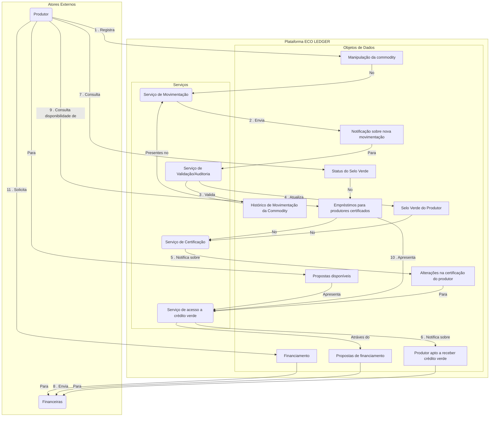
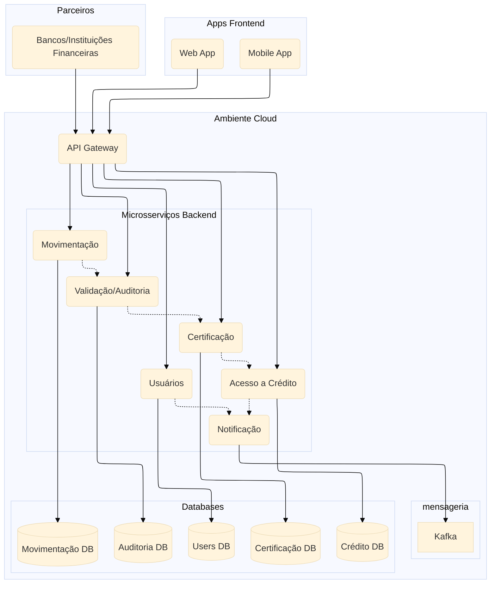

# **MBA+ SOFTWARE ENGINEERING DEVELOPMENT: TRABALHO 1**

## **Equipe**

* Geovana Cherubini (RM: 362820)
* Gustavo Valverde (RM: 362076)
* Fabricio Rodrigo (RM: 363892)
* Pedro Thormeyr (RM: 363410)
* Paulo Cesar (RM: 361591)

## **Professor**

* Profª . André Pontes Sampaio

---

## **1. Relato do Problema**

O agronegócio brasileiro enfrenta o desafio de atender à demanda por **transparência e sustentabilidade**. Atualmente,
os produtores rurais têm dificuldade em comprovar práticas socioambientais corretas9. Essa falta de comprovação impede o
acesso a **melhores condições de crédito** e a mercados mais exigentes.

A necessidade central é **centralizar os registros de movimentação e manipulação das commodities** que esses produtores
irão comercializar. O objetivo é usar esses registros para obter **certificações de sustentabilidade** no momento da
contratação de financiamentos.

---

## **2. Proposta de Solução**

### **Nome da Solução**

**ECO LEDGER** (A green Hub)

### **Objetivo Estratégico**

Certificar a origem dos produtos e **facilitar o acesso a crédito verde (green finance)** para produtores rurais
sustentáveis.  
Outros objetivos incluem:

* Consolidar imagem da marca nos mercados
* Aumentar a produtividade
* Obter incentivos financeiros
* Conscientização ambiental

### **Detalhes da Proposta**

* **Proposta de Solução?**
    * Plataforma de rastreabilidade para certificação e crédito verde.
* **Quem são seus usuários?**
    * Produtores rurais, Analistas de Crédito, Auditores.
* **Quem será seu concorrente?**
    * AgTrace, Agrosmart, IBM Food Trust.

---

## **3. Análise de Funcionalidades**

### **Atores do Sistema**

* Produtores
* Analista de crédito
* Auditores

### **Funcionalidades Identificadas**

* Solicitar Cadastro
* Cadastrar Commodity
* Registrar Movimentações na produção da commodity
* Consultar Selo Verde
* Consultar financiamentos disponíveis

---

## **4. Domain Story Telling**



---

## **5. Cenários de Testes**

```Gherkin

Feature: Solicitar Cadastro de Produtor Rural

  Scenario: Produtor preenche e envia cadastro válido
    Given que o Produtor Rural acessa a página de cadastro
    And que preenche todos os campos obrigatórios corretamente
    When o Produtor clicar em “Enviar Cadastro”
    Then o sistema registra o cadastro com status pendente e exibe mensagem “Cadastro enviado com sucesso para análise”

  Scenario: Produtor tenta enviar cadastro com dados incompletos
    Given que o Produtor Rural está na página de cadastro
    And que deixou campos obrigatórios em branco ou inválidos
    When o produtor clicar em “Enviar Cadastro”
    Then o sistema não registra o cadastro e exibe mensagem “Preencha todos os campos obrigatórios” 
```

```Gherkin

Feature: Aprovar ou Rejeitar Cadastro de Produtor Rural

  Scenario: Analista aprova cadastro pendente
    Given que o Analista de Crédito está autenticado
    And há cadastro pendente para análise
    When o Analista clicar em “Aprovar”
    Then o sistema atualiza o status para aprovado e notifica o Produtor sobre aprovação

  Scenario: Analista rejeita cadastro de produtor
    Given que o Analista está autenticado
    And há cadastro pendente para análise
    When o Analista clicar em “Rejeitar” com motivo
    Then o sistema atualiza o status para rejeitado e envia notificação ao Produtor com o motivo 
```

```Gherkin

Feature: Cadastrar Commodity para Certificação

  Scenario: Produtor cadastra commodity válida
    Given que o Produtor está autenticado
    And possui dados corretos da commodity
    When cadastrar a commodity
    Then o sistema salva a commodity para certificação e confirma cadastro com mensagem ao Produtor “Nova commodity registrada.”

  Scenario: Falha no cadastro da commodity
    Given que o Produtor está autenticado
    And os dados da commodity estão incompletos ou inválidos
    When tentar cadastrar a commodity
    Then o sistema rejeita o cadastro e exibe mensagem de erro adequada “Revise seus dados inseridos - 404” 
```

```Gherkin

Feature: Registrar Movimentações na Produção da Commodity

  Scenario: Produtor registra movimentação válida
    Given que o Produtor está autenticado
    And possui dados válidos da movimentação
    When registrar movimentação
    Then o sistema grava o registro e confirma com mensagem de sucesso “Movimentação registrada!”

  Scenario: Registro inválido de movimentação
    Given que o Produtor está autenticado
    And os dados da movimentação estão errados ou incompletos
    When tentar registrar movimentação
    Then o sistema rejeita a operação e alerta o Produtor do erro “Ocorreu um erro ao registrar nova movimentação. Tente novamente e revise os dados inseridos.” 
```

```Gherkin

Feature: Validar e Auditar Dados para Certificação

  Scenario: Sistema valida movimentação e atualiza selo verde
    Given que o Registro de movimentação foi submetido
    When o sistema validar os dados com sucesso
    Then atualiza o selo do Produtor para ativo e notifica os serviços envolvidos, sendo o contrato e bureaus de dados

  Scenario: Registro inválido de movimentação
    Given que o registro não cumpre os critérios de validação
    When o sistema processar a validação
    Then sinaliza rejeição da movimentação e mantém selo verde com baixa prioridade de oferta de crédito 
```

```Gherkin

Feature: Consultar Status do Selo Verde

  Scenario: Produtor consulta selo ativo
    Given que Produtor está autenticado
    When solicitar status do selo verde
    Then o sistema exibe selo ativo “ATIVO”

  Scenario: Produtor consulta selo pendente ou rejeitado
    Given que Produtor está autenticado
    When solicitar status do selo verde
    Then o sistema informa selo pendente ou rejeitado “INATIVO” ou “EM ANÁLISE” 
```

```Gherkin

Feature: Solicitar Financiamento com Base na Certificação

  Scenario: Produtor com selo ativo solicita financiamento
    Given que o Produtor possui selo verde ativo
    When solicitar propostas de financiamento
    Then o sistema apresenta propostas disponíveis

  Scenario: Produtor sem selo ativo tenta solicitar financiamento
    Given que o Produtor não possui selo verde ativo
    When tentar solicitar financiamento
    Then o sistema bloqueia a solicitação e exibe mensagem explicativa “Para melhores condições de crédito e muitos outros benefícios, consulte o guia de aquisição do SELO VERDE”
```

```Gherkin

Feature: Notificar Aprovação de Financiamento

  Scenario: Sistema notifica aprovação de empréstimo
    Given que o financiamento foi aprovado pelas instituições financeiras
    When registrar a aprovação no sistema
    Then o Produtor e as Instituições Financeiras recebem notificação da aprovação “Concessão de crédito aprovado. Para mais informações acesse o link {instituição financeira}”

  Scenario: Sistema notifica rejeição de empréstimo
    Given que o financiamento foi rejeitado
    When registrar rejeição no sistema
    Then o Produtor recebe notificação da rejeição, “Não foi possível concluir a concessão de crédito! Para mais informações acesse o link {instituição financeira}” 
```

```Gherkin

Feature: Consultar Histórico de Movimentações

  Scenario: Analista consulta histórico completo
    Given que o Analista está autenticado
    When solicitar histórico de movimentações de um Produtor
    Then o sistema apresenta o histórico detalhado

  Scenario: Analista sem permissão tenta acessar dados
    Given que o Analista não tem autorização para acessar dados específicos
    When tentar consulta
    Then o sistema nega acesso e informa restrição de permissão, “Acesso restrito” 
```

```Gherkin

Feature: Auditar Alterações na Certificação

  Scenario: Auditor consulta histórico de alterações
    Given que Auditor está autenticado
    When solicitar histórico de alterações na certificação
    Then o sistema exibe registros completos

  Scenario: Auditor registra resultado da auditoria
    Given que Auditor realizou a auditoria
    When registrar resultados e observações
    Then o sistema salva os dados da auditoria com sucesso 
```

---

## **6. Projeto da Solução (Microserviços)**

### **Lista de Microserviços Propostos**

* **Serviço de Usuários (Cadastro):** Responsável pelo cadastro, autenticação e gerenciamento de perfis de Produtores,
  Analistas e Auditores.
* **Serviço de Movimentação (Rastreabilidade):** Gerencia o registro de todas as manipulações e movimentações da
  commodity.
* **Serviço de Validação/Auditoria:** Valida as movimentações registradas contra as regras de sustentabilidade e
  gerencia o processo de auditoria.
* **Serviço de Certificação (Selo Verde):** Consolida as validações para emitir, atualizar e consultar o status do "Selo
  Verde" do produtor.
* **Serviço de Acesso a Crédito (Financiamento):** Gerencia a consulta de propostas de financiamento, a solicitação de
  crédito e a comunicação com as financeiras.
* **Serviço de Notificação:** Responsável por enviar notificações (e-mail, push, etc.) para os atores sobre mudanças de
  status (ex: cadastro aprovado, selo emitido, crédito aprovado).

### **Diagrama da Arquitetura de Microserviços**

